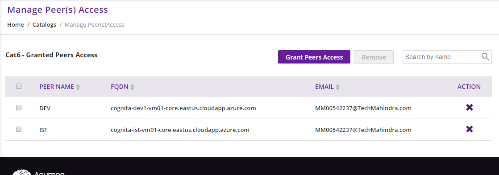
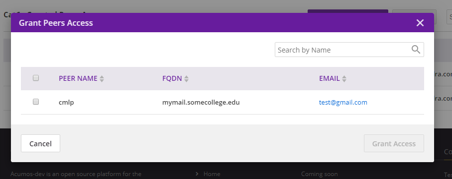
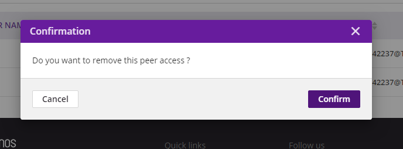

.. ===============LICENSE_START=======================================================
.. Acumos CC-BY-4.0
.. ===================================================================================
.. Copyright (C) 2017-2018 AT&T Intellectual Property & Tech Mahindra. All rights reserved.
.. ===================================================================================
.. This Acumos documentation file is distributed by AT&T and Tech Mahindra
.. under the Creative Commons Attribution 4.0 International License (the "License");
.. you may not use this file except in compliance with the License.
.. You may obtain a copy of the License at
..
.. http://creativecommons.org/licenses/by/4.0
..
.. This file is distributed on an "AS IS" BASIS,
.. WITHOUT WARRANTIES OR CONDITIONS OF ANY KIND, either express or implied.
.. See the License for the specific language governing permissions and
.. limitations under the License.
.. ===============LICENSE_END=========================================================

====================
ManagePeer(s) Access
====================

- Through this functionality user can allow peers to access restricted catalogs.   
- Federation allows peers to access only public catalogs.
- For restricted catalog access peers need to get permission from the user.

In order to provide access user will see a button enabled only for restricted catalogs in **Action** coloumn under catalog page.

                 
User can grant permission to the peers to provide access to Restricted Catalogs.
On click of **Grant Peer Access** button you can see a dialog through which user can give grant permission to peers.
**Grant Peer Access** button will be disabled when all the peers got access from the user.

User can remove access to the peers to restrict access for Restricted Catalogs.
For removing single peer user should click on cross button under **ACTION** column of corresponding row.
For removing multiple peers user should select peers and click on **Remove** button.
**Remove** button will be disabled when no peer is selected for removal.

                  
                 

 

