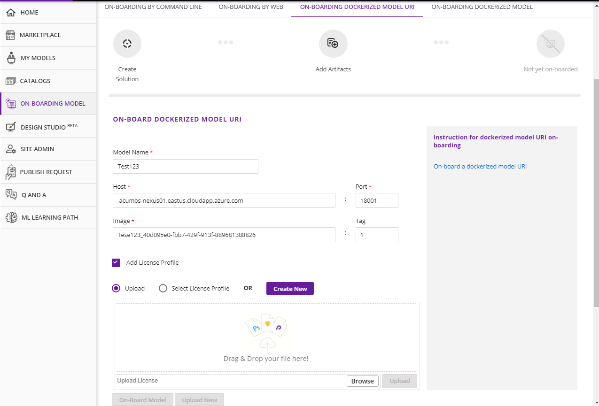

.. ===============LICENSE_START=======================================================
.. Acumos CC-BY-4.0
.. ===================================================================================
.. Copyright (C) 2017-2018 AT&T Intellectual Property & Tech Mahindra. All rights reserved.
.. ===================================================================================
.. This Acumos documentation file is distributed by AT&T and Tech Mahindra
.. under the Creative Commons Attribution 4.0 International License (the "License");
.. you may not use this file except in compliance with the License.
.. You may obtain a copy of the License at
..
.. http://creativecommons.org/licenses/by/4.0
..
.. This file is distributed on an "AS IS" BASIS,
.. WITHOUT WARRANTIES OR CONDITIONS OF ANY KIND, either express or implied.
.. See the License for the specific language governing permissions and
.. limitations under the License.
.. ===============LICENSE_END=========================================================

====================================================
On-Boarding Pre-Dockerized Model Using the Portal UI
====================================================

Acumos allows users to On-board their docker image models. Each model dockerized outside 
acumos by modelers can be On-boarded in Acumos. You just have to use the **On-boarding dockerized model** 
panel in the **on-boarding model** page of the Acumos portal.In this panel you can find two options.

	.. image:: ../images/portal/onboarding-dockerized-model.PNG
                 :width: 75%

- Upload New 

When you click **Upload New** button , you will get **Model Name** field, just type the desired name of the model
and click on **Check Availability** to check whether the model name is available.

If model name is available, It will ask you for Upload Protobuf file and Upload License file. It is optional.
	
	.. image:: ../images/portal/onboarding-dockerized-model-license.PNG
                 :width: 75%
				 
Now Upload Protobuf file with an extension of **.proto** and Upload License file with an extension of **.json**

	.. image:: ../images/portal/onboarding-dockerized-model-license-browse.PNG
                 :width: 75%

In case of License.....

There are two radio buttons **Upload** and **Select License Profile** 
from where user can upload license file which must be with an extension of *.json* which contains high level general terms and conditions for use of the model.

If **Upload** radio button is selected it will allow user to browse a license.json file. Once the file is selected the **Upload** button is enabled clicking which file will be uploaded. 

.. image:: ../images/portal/model-onboarding-docker-uri-upload.png
                 :width: 75%
				 
**Select License Profile** radio button allows the user to select a license template from a drop-down list. The **Modify** button allows the user to change the content of template. 

.. image:: ../images/portal/model-onboarding-docker-uri-select-license.png
                 :width: 75%
				 
Upon clicking the **Modify** button a pop-up will be opened which allows the user to change license templates content. The **Save** button will save the license template.

.. image:: ../images/portal/model-onboarding-docker-uri-modify.png
                 :width: 75%

.. image:: ../images/portal/model-onboarding-docker-uri-save.png
                 :width: 75%

The **Create** button will allow the user to create a new license template. 

.. image:: ../images/portal/model-onboarding-docker-uri-create.png
                 :width: 75%

Click the **Create Docker Image Reference** 
button which is shown after name validation. 

	.. image:: ../images/portal/onboarding-dockerized-model-new.PNG
                 :width: 75%

- Upload Revision

When you click on **Upload Revision** button, you can search the existing model and select that model. It will ask you for Upload Protobuf file and Upload License file. It is optional. You can Click on **Update Docker Image Reference**  button which is shown after selecting your model.

	.. image:: ../images/portal/onboarding-dockerized-model-uploadrev.PNG
                 :width: 75%
In case of License.....

There are two radio buttons **Upload** and **Select License Profile** 
from where user can upload license file which must be with an extension of *.json* which contains high level general terms and conditions for use of the model.

If **Upload** radio button is selected it will allow user to browse a license.json file. Once the file is selected the **Upload** button is enabled clicking which file will be uploaded. 

.. image:: ../images/portal/model-onboarding-docker-uri-upload.png
                 :width: 75%
				 
**Select License Profile** radio button allows the user to select a license template from a drop-down list. The **Modify** button allows the user to change the content of template. 

.. image:: ../images/portal/model-onboarding-docker-uri-select-license.png
                 :width: 75%
				 
Upon clicking the **Modify** button a pop-up will be opened which allows the user to change license templates content. The **Save** button will save the license template.

.. image:: ../images/portal/model-onboarding-docker-uri-modify.png
                 :width: 75%

.. image:: ../images/portal/model-onboarding-docker-uri-save.png
                 :width: 75%

The **Create** button will allow the user to create a new license template. 

.. image:: ../images/portal/model-onboarding-docker-uri-create.png
                 :width: 75%

In the above both cases, you will receive the Acumos image reference in the **My Image Model** field which is to be used 
to push your docker image model in Acumos.

This Acumos image reference looks like :

<acumos_domain>:<docker_proxy_port>/modelname_soultion_id:tag

Below are the steps to push your docker image.

#. Login the Acumos Docker Registry

	docker login https://<acumos_domain>:<docker_proxy_port> -u <acumos_userid> -p <acumos_password>

#. Tag the docker image model with the Acumos image reference 

	docker tag my_image_model <acumos_domain>:<docker_proxy_port>/modelname_solution_id:tag
   
#. Push the model in Acumos

	docker push <acumos_domain>:<docker_proxy_port>/modelname_solution_id:tag

