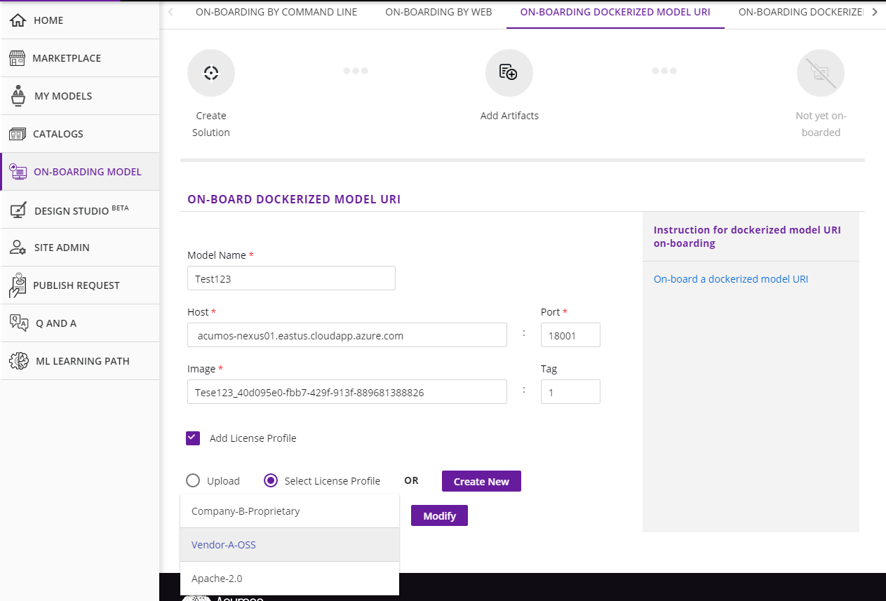

.. ===============LICENSE_START=======================================================
.. Acumos CC-BY-4.0
.. ===================================================================================
.. Copyright (C) 2017-2018 AT&T Intellectual Property & Tech Mahindra. All rights reserved.
.. ===================================================================================
.. This Acumos documentation file is distributed by AT&T and Tech Mahindra
.. under the Creative Commons Attribution 4.0 International License (the "License");
.. you may not use this file except in compliance with the License.
.. You may obtain a copy of the License at
..
.. http://creativecommons.org/licenses/by/4.0
..
.. This file is distributed on an "AS IS" BASIS,
.. WITHOUT WARRANTIES OR CONDITIONS OF ANY KIND, either express or implied.
.. See the License for the specific language governing permissions and
.. limitations under the License.
.. ===============LICENSE_END=========================================================

=======================================================
On-Boarding a Model with Docker URI Using the Portal UI
=======================================================

Acumos allows users to On-board a model which has already stored in docker repo like Docker Hub 
even outside Acumos domain. To on-board this type of model, you should have docker image details.

Once you are ready with details, just click on **ON-BOARDING DOCKERIZED MODEL URI** panel which is 
just right side of the **ON-BOARDING BY WEB** on the **ON-BOARDING MODEL** page of the Acumos portal.

Enter the mandatory details like Model Name, Host(the docker registry), Port and Image , optionally Tag. 
You can upload the license file associated with this docker URI model as per your choice. When you click on 
**On-Board Model** , the model will be on-boarded after completion of backend process steps (like **Create 
Solution** and **Add Artifacts**) and available in **MY MODELS** page, you can view this by clicking **View Model**. 

.. image:: ../images/portal/model-onboarding-docker-uri.png
	    :width: 75%
	

License can be added optionally. **ADD LICENSE PROFILE** check box allows the user to add license file while On-boarding the model. There are two radio buttons **Upload** and **Select License Profile** 
from where user can upload license file which must be with an extension of *.json* which contains high level general terms and conditions for use of the model.

.. image:: ../images/portal/model-onboarding-docker-uri-license.png
                 :width: 75%

If **Upload** radio button is selected it will allow user to browse a license.json file. Once the file is selected the **Upload** button is enabled clicking which file will be uploaded. 

				 
**Select License Profile** radio button allows the user to select a license template from a drop-down list. The **Modify** button allows the user to change the content of template. 

				 
Upon clicking the **Modify** button a pop-up will be opened which allows the user to change license templates content. The **Save** button will save the license template.

.. image:: ../images/portal/model-onboarding-docker-uri-modify.png
                 :width: 75%

.. image:: ../images/portal/model-onboarding-docker-uri-save.png
                 :width: 75%

The **Create** button will allow the user to create a new license template. 

.. image:: ../images/portal/model-onboarding-docker-uri-create.png
                 :width: 75%

