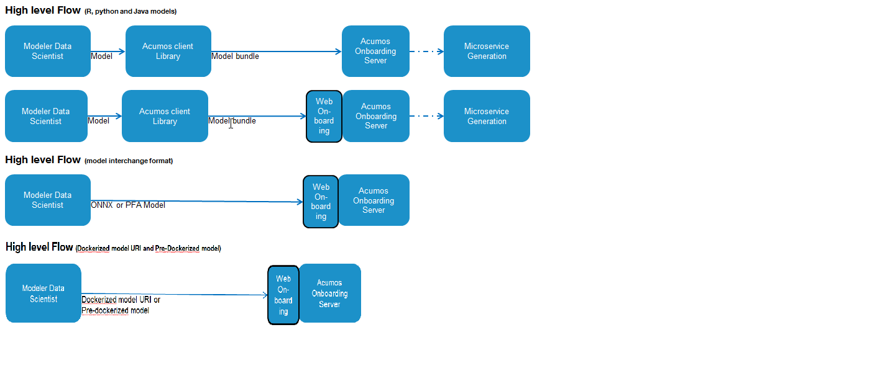
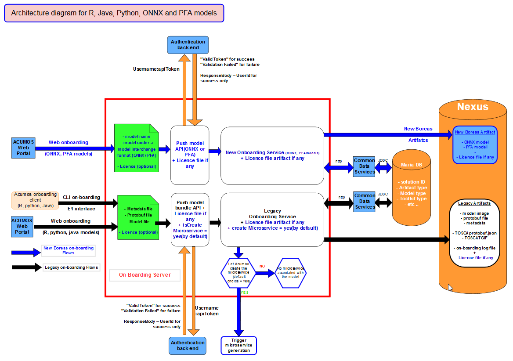

.. ===============LICENSE_START=======================================================
.. Acumos CC-BY-4.0
.. ===================================================================================
.. Copyright (C) 2017-2018 AT&T Intellectual Property & Tech Mahindra. All rights reserved.
.. ===================================================================================
.. This Acumos documentation file is distributed by AT&T and Tech Mahindra
.. under the Creative Commons Attribution 4.0 International License (the "License");
.. you may not use this file except in compliance with the License.
.. You may obtain a copy of the License at
..
.. http://creativecommons.org/licenses/by/4.0
..
.. This file is distributed on an "AS IS" BASIS,
.. WITHOUT WARRANTIES OR CONDITIONS OF ANY KIND, either express or implied.
.. See the License for the specific language governing permissions and
.. limitations under the License.
.. ===============LICENSE_END=========================================================

==========================
Model On-Boarding Overview
==========================

Acumos is intended to enable the use of a wide range of tools and technologies in the development
of machine learning models including support for both open sourced and proprietary toolkits.

The goal of Onboarding is to provide an ingestion interface, by web or CLI(command line interface)
for various types of models and to create required artifacts and identifiers to enter the  Acumos
machine learning platform.

In short, our goals are to generate or provide all the necessary materials required to use the models
with the others components of Acumos like :

- Tosca file for Design studio

- Represent model I/O such for microservice generation

- SolutionID for CDS

- Licence file

For model in a model interchange format like ONNX and PFA, only web interface is useable to upload them in the platform 

For models developped in Java, Python 3.0, R and sourced from toolkits such as Scikit, TensorFlow,
H2O, and R, On-boarding allows user to create containerized microservice at the end of the on-boarding process. If user choose to not create the microservice during on-boarding he can create it later.

These kinds of Models can be easily onboarded and wrapped into containerized microservices which are
interoperable with many other components.The solution for accommodating a myriad of different model
types is to provide a custom wrapping library for each runtime. The client library encapsulates the
complexity surrounding the serialization and deserialization of models. Additionally, the client library
creates a common native interface, a wrapper, for invoking the inner model. In order for Acumos to be
able to reason about models uniformly, there is a common model interface description that details what
the available  model methods are and what they look like. Acumos instantiates ML models as microservices
and safely composes them together.

.. Acumos accommodates the use of a wide range of tools and  technologies in the 
.. development of machine learning models, including support for both open source 
.. and proprietary toolkits. Models can be easily onboarded and wrapped into 
.. containerized microservices which are interoperable with many other components. 
.. On-boarding provides an ingestion interface for various  types of models to 
.. enter the Acumos Machine Learning (ML) platform. Examples  of models include 
.. well-defined objects such as scikit-learn estimators, TensorFlow weights, and 
.. arbitrary R functions.

.. The solution for accommodating a myriad of different model types is to provide 
.. a custom wrapping library for each runtime. The client library encapsulates the 
.. complexity surrounding the serialization and deserialization of models. 
.. Additionally, the client library creates a common native interface, a wrapper, 
.. for invoking the inner model. In order for Acumos to be able to reason about 
.. models uniformly, there is a common model interface description that details 
.. what the available  model methods are and what they look like. Acumos 
.. instantiates ML models as microservices and safely composes them together.

Architecture
============

High-level architecture Design for Boreas :

Low-level architecture Design for Boreas : 

.. .. image:: ../images/onboarding/UseCase.png

.. In the illustrations below, custom transformation functions which consume and produce a native DataFrame are converted to standardized native models. The  transforms are then composed together in Acumos as microservices. This illustration begs the question of how the DataFrame can be  represented abstractly in order to validate this workflow.

.. .. image:: ../images/onboarding/UG_image3.png

.. .. image:: ../images/onboarding/UG_image4.png

.. .. image:: ../images/onboarding/UG_image5.png

.. Methods and Semantics (it is rather for developper guide)
.. =====================

.. Acumos is a machine learning platform, thus we need to provide certain “methods” in our wrapped models that Acumos can invoke in order to support various workflows. In a machine learning setting, these methods might look like:

.. - fit(message) -> model state

..    - Does a full “batch” fit, replacing previous internal model parameters
      - Returns a “model state” object that provides a standard serialization method

.. - partial_fit(message) -> model state

..    - Does a partial fit, updating internal model parameters
..    - Returns a “model state” object that provides a standard serialization method

.. - transform(message) -> message

..    - Returns an object that provides a standard serialization method

On-Boarding Client Libraries
============================

It exists three client libraries that supports the onboarding of Python, Java and
R models.

The Acumos on-boarding process generates everything needed to create an executable
microservice for your model and add it to the catalog.  Acumos uses Protobuf as a
language-agnostic data format to provide a common description of the model data inputs 
and outputs.

The appropriate client library does the first step of the on-boarding process. This includes:

#. Introspection to assess the toolkit library versions and determine file types
#. Creation of a JSON description of the system
#. Creation of the protobuf file
#. model bundle push to the Acumos on-boarding server 
#. licence push to the Acumos on-boarding server (optional)

The model bundle is an archive compose of the model, the JSON file and the Protobuf file previously 
created by the client library.

On-Boarding By Web
==================

Users can also onboard model coming from R, python or Java by web, but the first step is to use the
on-boarding client to create the model bundle and then upload this model bundle thanks to the web 
on-boarding page of the Acumos portal.

For ONNX and PFA models it doesn't exist a client library and so no model bundle. You just have to onboard
the model itself by using use the on-boarding Web page of your acumos portal. Onboard a model under a model 
interchange format like ONNX and PFA is just an upload & store processus.

On-Boarding Server
==================

The On-boarding server is in charge to : 

#. Request the authentication backend to authenticate the user.
#. Store all the artifacts and model in Nexus.
#. Create a Solution-Id for each new model onboarded.
#. Check if model has already been onboarded if yes, update the revision-Id and associated artifatcs for this model.
#. Fill artifact type, Model type, Toolkit type associated to a Solution ID in CDS(Common Data Service) database.
#. Trigger the creation of Microservice based on what user choose during WEB or CLI onboarding.

