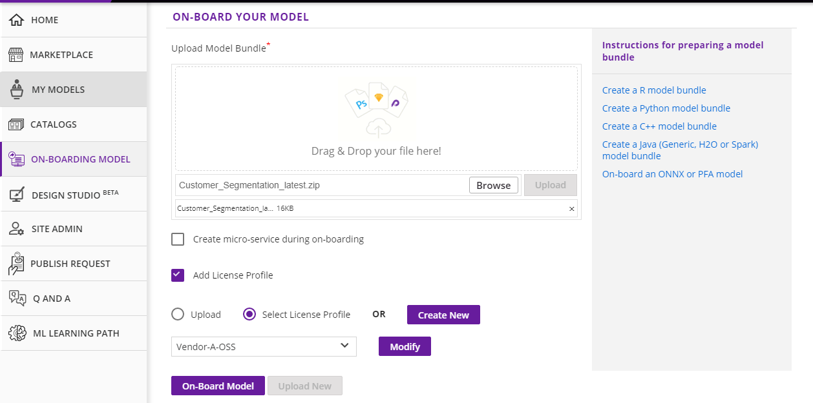
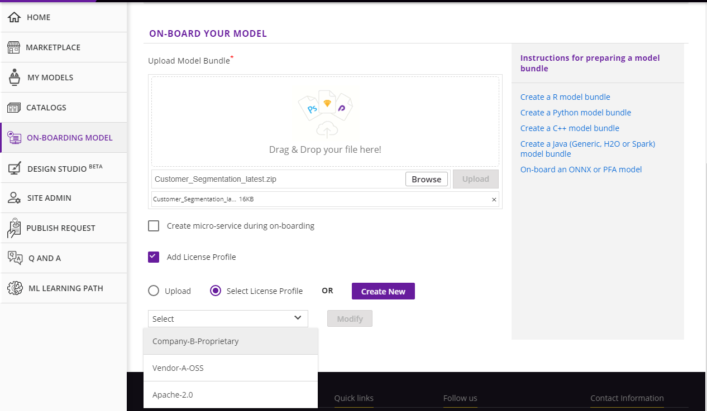

.. ===============LICENSE_START=======================================================
.. Acumos CC-BY-4.0
.. ===================================================================================
.. Copyright (C) 2017-2018 AT&T Intellectual Property & Tech Mahindra. All rights reserved.
.. ===================================================================================
.. This Acumos documentation file is distributed by AT&T and Tech Mahindra
.. under the Creative Commons Attribution 4.0 International License (the "License");
.. you may not use this file except in compliance with the License.
.. You may obtain a copy of the License at
..
.. http://creativecommons.org/licenses/by/4.0
..
.. This file is distributed on an "AS IS" BASIS,
.. WITHOUT WARRANTIES OR CONDITIONS OF ANY KIND, either express or implied.
.. See the License for the specific language governing permissions and
.. limitations under the License.
.. ===============LICENSE_END=========================================================

=======================================
On-Boarding a Model Using the Portal UI
=======================================

A high-level summary of the on-boarding steps and overview of the
workflow is shown below:

    .. image:: ../images/portal/models_onboardingJourney.png

Prerequisites : You have to create a model bundle in your own environment 
before start to on-board. Acumos cannot transform your model in a microservice 
with only the model itself, it needs some other relevant information contained 
in the model bundle. The model bundle consists of component.json defining the 
component and its metadata and component.proto with the protobuf specs. 
You can retrieve all the information to create your model bundle in the 
"ON-BOARDING BY WEB" home page

    .. image:: ../images/portal/models_onboardingWeb.png

Once your model bundle has been created, follow these steps:

#. Select the "ON-BOARDING MODEL" tab in the outer left menu
#. Select "ON-BOARDING BY WEB"
#. Drag & Drop your model bundle or use the **Browse** button to select it
#. Click **Upload**
#. When uploading is finished, click on **On-Board Model**.

    .. image:: ../images/portal/models_onboardingWebNotice.png

This will initiate a series of back-end process steps, illuminated as they run, 
by the cascade from left to right of the icons on the top of the page. These 
include creating the microservice that will run in a docker container, 
creating a TOSCA file for your model so it can be used in the Design Studio, 
and storing the artifacts and model.

    .. image:: ../images/portal/models_onboardingWebSuccess.png
       :width: 75%

On-boarding is finished when all steps turn green. Click the **View Model** 
button to see your model in the **MY UNPUBLISHED MODELS** section of the 
:doc:`My Models <portal-my-models>` page.

If one of the steps appears in red, on-boarding has failed. Check your 
:doc:`notifications <portal-notifications>` to determine why on-boarding failed 
- there should be a message with a link to download on-boarding log files. If 
you need help debugging, please reach out to the Acumos Community or Dev 
Discuss `mailing lists <https://lists.acumos.org/g/main/subgroups>`_ or post on 
`StackOverflow <https://stackoverflow.com/search?q=acumos>`_.

The above On-boarding process is along with microservice generation. If you dont
want MicroService Generation you can uncheck  **Create micro-service during on-boarding**
checkbox which is checked by default.

    .. image:: ../images/portal/model-onboarding-wo-microservice-success.png
             :width: 75%
	  
The above process will skip the steps **Dockerize** and **Add Docker Image** when we uncheck 
**Create micro-service during on-boarding**. You can see the Create Solution, Add Artifacts 
and Create Tosca steps turn green. Click the **View Model** button to see your model in the 
**MY UNPUBLISHED MODELS** section of the :doc:`My Models <portal-my-models>` page. You can 
see **Create Microservice** button  which is right side of ** Manage My Model** button to 
create MicroService for your model.

License file must be uploaded while On-boarding the model. There are two radio buttons **Upload** and 
**Select License Profile** from where user can upload license file which must be with an extension of *.json* 
which contains high level general terms and conditions for use of the model.

If **Upload** radio button is selected it will allow user to browse a license.json file. 
Once the file is selected the **Upload** button is enabled clicking which file will be uploaded. 

				 
**Select License Profile** radio button allows the user to select a license template from a drop-down list. 
The **Modify** button allows the user to change the content of template. 

				 
Upon clicking the **Modify** button a pop-up will be opened which allows the user to change license templates content. 
The **Save** button will save the license template.

The **Create** button will allow the user to create a new license template. 

	

